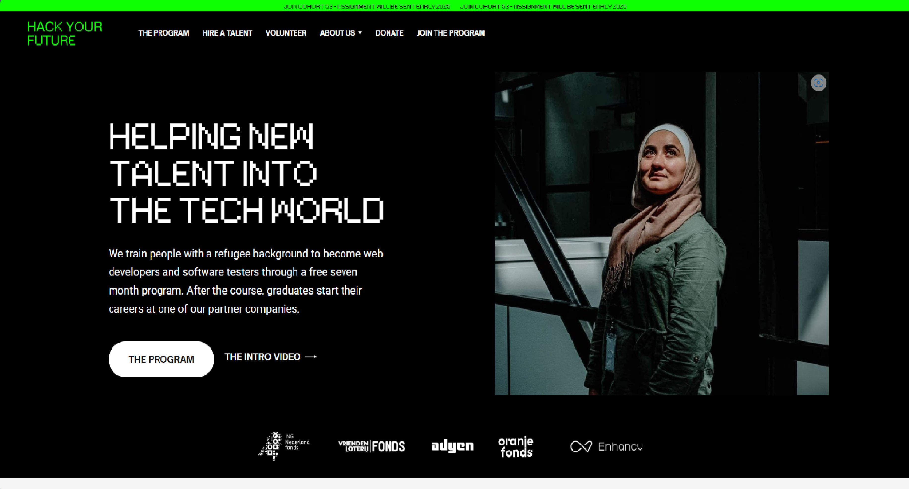

# Hack Your Future

> Hack Your Future is practice agile development, HTML and CSS

## Table of contents

- [Hack Your Future](#hack-your-future)
  - [Table of contents](#table-of-contents)
  - [General info](#general-info)
  - [Screenshots](#screenshots)
  - [Technologies](#technologies)
  - [Setup](#setup)
  - [Code Examples](#code-examples)
  - [Features](#features)
  - [Status](#status)
  - [Inspiration](#inspiration)
  - [Contact](#by)
  - [Instructions for use](#instructions-for-use)
  - [Code Quality Checks](#code-quality-checks)
  - [Continuous Integration (CI)](#continuous-integration-ci)
  - [Repo Setup](#repo-setup)

## General info

> HackYourFuture is a not-for-profit coding school for people with limited
> access to education and the labor market.

## Screenshots



## Technologies

- Node 14.16.0
- VSC code
- CSS
- HTML

## Setup

- git clone <https://github.com/BF-FrontEnd-class-2025/group-1-hyf.git>
- npm install

## Code Examples

```css
-webkit-text-size-adjust: 100%;
--dark-gray: #131313;
--border-dark: #13131326;
--white: white;
--border-white: #ffffff26;
--light-gray: whitesmoke;
color: var(--dark-gray);
font-family: Open Sauce One, sans-serif;
font-weight: 500;
font-size: 16px;
line-height: 24px;
-webkit-font-smoothing: antialiased;
box-sizing: border-box;
z-index: 2;
width: 100%;
position: relative;
opacity: 1;
```

## Features

List of features ready and Todos for future development

-
-
-

To-do list:

-
-

## Status

Project is: _in progress_

## Inspiration

Project by freeCodeCamp.org

### By

[Melbana](https://github.com/MElbanna200/MElbanna200.git)

[Arsan](https://github.com/A-SHA256/A-SHA256.git)

[Susana](https://github.com/SusanaLoaiza/SusanaLoaiza.git)

[anton](https://github.com/antonaksyuk/antonaksyuk.git)

## Instructions for use

<details>
  <summary>Getting Started</summary>

<!-- a guide to using this repository -->

1. `git clone git@github.com:HackYourFutureBelgium/template-markdown.git`
2. `cd template-markdown`
3. `npm install`

## Code Quality Checks

- `npm run format`: Makes sure all the code in this repository is well-formatted
  (looks good).
- `npm run lint:ls`: Checks to make sure all folder and file names match the
  repository conventions.
- `npm run lint:md`: Will lint all of the Markdown files in this repository.
- `npm run lint:css`: Will lint all of the CSS files in this repository.
- `npm run validate:html`: Validates all HTML files in your project.
- `npm run spell-check`: Goes through all the files in this repository looking
  for words it doesn't recognize. Just because it says something is a mistake
  doesn't mean it is! It doesn't know every word in the world. You can add new
  correct words to the [./.cspell.json](./.cspell.json) file so they won't cause
  an error.
- `npm run accessibility -- ./path/to/file.html`: Runs an accessibility analysis
  on all HTML files in the given path and writes the report to
  `/accessibility_report`

## Continuous Integration (CI)

When you open a PR to `main`/`master` in your repository, GitHub will
automatically do a linting check on the code in this repository, you can see
this in the[./.github/workflows/lint.yml](./.github/workflows/lint.yml) file.

If the linting fails, you will not be able to merge the PR. You can double check
that your code will pass before pushing by running the code quality scripts
locally.

## Repo Setup

- Give each member **_write_** access to the repo (if it's a group project)
- Turn on GitHub Pages and put a link to your website in the repo's description
- Go to _General_ Section > check **Discussions**
- In the _Branches_ section of your repo's settings make sure the
  `master`/`main` branch must:
  - "_Require a pull request before merging_"
  - "_Require approvals_"
  - "_Dismiss stale pull request approvals when new commits are pushed_"
  - "_Require status checks to pass before merging_"
  - "_Require branches to be up to date before merging_"
  - "_Do not allow bypassing the above settings_"

</details>
